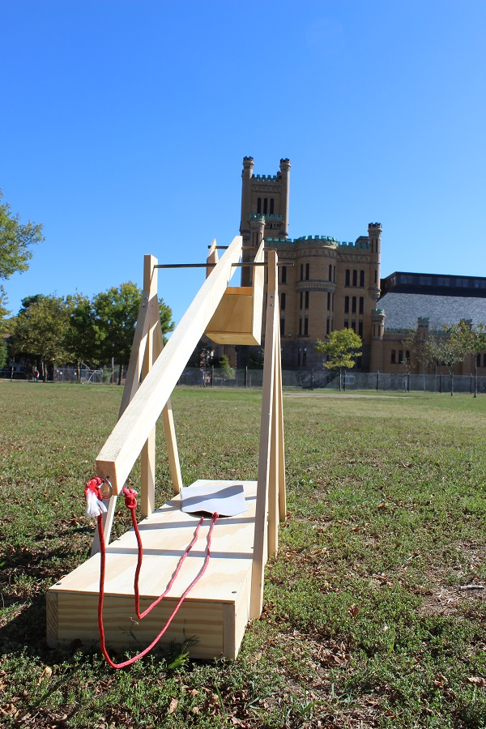

## Introduction

Everyone knows what a catapult is. It throws stones and flaming projectiles at castles. It is famous – and rightfully so. But for some reason the trebuchet, which is a different type of siege engine, is not so famous. Yet, it is much more powerful than a catapult. It can launch heavier projectiles longer distances and is much easier to build! Rather than using complicated twisted ropes, a trebuchet uses the power of gravity to launch its projectile. In this tutorial you will learn how to build one that is 3 ft (91 cm) tall and capable of launching projectiles at some pretty amazing distances. 
Everything in this build is very common except for two small parts: a welded ring and several push-on external retaining rings. However, even these are easy to get and you can even improvise something as a replacement for them. We will take a closer look at them as they are needed in the build. And we will offer you possible alternatives. 
This build is well within reach of a person who has minimal DIY skills. Can you use a drill and a hammer? Then in about six hours you will be launching tennis balls at your neighbour’s house. But don’t do that! Your neighbour might also read this tutorial and build one for themselves. Then you will have a right proper medieval warfare campaign right in your own back yard...
We purchased all the parts at a local (US) home improvement store. The wood cost $44.62; the various other parts, paracord, steel bar, nails, screws and everything else cost $28.26, for a total of $72.88. You can reduce this price significantly if you have some of the materials on-hand. A good example is the screws: if you buy full boxes, you’ll have plenty for future projects. If you already have an assortment of nails and screws, you can reduce the cost of this project by $15. 
A trebuchet works the same way as a see-saw. If you sit down very quickly on one end of a see-saw, the other end pops up equally quickly. And the heavier the weight, the faster the pop-up. If you shift the fulcrum closer to where you push, the other end will travel even faster. A trebuchet capitalises on this. It uses the principle of a fulcrum and the power of gravity to launch projectiles rapidly into the air. 
We will build this trebuchet in four major parts: the base, the swing arm, the ballast box, and the string/pouch assembly.

### What you will make

Add something here to showcase here, for example:

