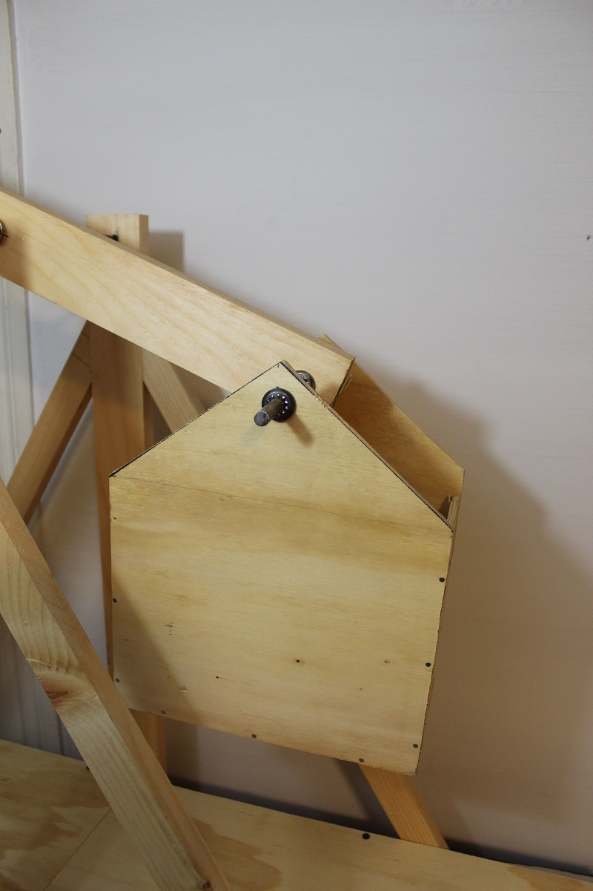

## The Balast Box
Our final piece of wood is the second piece of plywood. Measure out a box to make. The box is made up of five pieces and it has a 3/8˝ (9.5 mm) hole 1 inch (25 mm) from the top. When making this box you should be aware that it needs to swing freely without hitting anything on the trebuchet, including the swing arm and the base of the trebuchet. Attach it to the swing arm hole one inch from the end. Cut a piece of your 3/8˝ (9.5 mm) steel bar for this. 

The house shaped ballast box is 10˝ (25 cm) wide and 12˝ (30 cm) tall. You can trim the top 4˝ (10 cm) of it to form the triangular roof of the house shape. Measure and cut two of these. The sides of the box hold those house shapes 6˝ (15 cm) apart. You have a lot of freedom in making a ballast box. Just be sure it doesn’t rub on any part of the trebuchet base or swing arm throughout its full swinging motion. 

