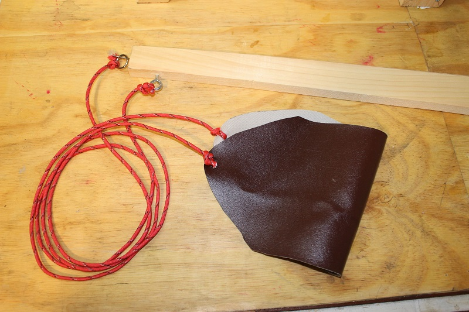

## The string and sling
This is the most important part of the build, but also the easiest. The sling itself is a piece of cloth or soft leather 8˝ × 16˝ (20 × 41 cm), folded in half. You can trim the cloth of the sling so the top of each end is triangular, similar to the house shape of the ballast box, but triangular-shaped on both ends of it. Cut two lengths of paracord each to 48˝ (122 cm) and tie them to the tips of the sling. Then attach one to an eyehook at the end of the swing arm. And on the other length of paracord, attach a metal ring. We used something called a welded ring, bought at a hardware store for about a dollar. You can use a keyring for this. It is important to use a metal ring that will easily slide over the nail without catching or getting stuck. 

In the picture you can see a nail sticking out of the end of the swing arm. This nail is critical. Use a 6d (51 mm) nail and file the head off of it. Hammer it into the end of the trebuchet so it sticks out. 

For this project we use two lengths of 3/8˝ (9.5 mm) steel rod. You can just feed these lengths through the holes and the trebuchet will work. But with repeated use, things will start to slip. To prevent this you should secure the parts in place on the rod with washers and some kind of locking rings. The easiest and cheapest way to do this is with push-on external retaining rings. They are simple little metal rings that you push by hand right over the steel bar. They have small internal teeth on them and stay locked onto the bar wherever you place them. We purchased some at a hardware store for 40 cents each.

