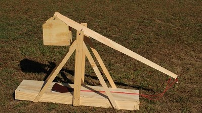

## Fire!
Fill the ballast box with weight, put a projectile in the sling and pull the swing arm down. Place the ring over the release pin. Inspect everything to ensure the paracord is laid out straight on the base of the trebuchet and not twisted. Fire it by letting go of the swing arm. As the swing arm moves in its arc, it pulls both strings evenly, bringing the pouch along the base of the trebuchet. At a point in its swing near vertical, the ring will slide right off the nail/pin. This opens the sling and releases the projectile. 

This trebuchet is a simple machine with only two moving parts. If you have trouble launching projectiles, here are some things to look for: 

First, you should look to the ballast basket. Is it rubbing or hitting on something? Does it not allow for smooth motion of the swing arm? Adjust it, resize it, or trim it as needed. If your trebuchet fires its projectile straight up or backwards, your nail needs to lean more forward. If your trebuchet fires its projectile at the ground or not too far then your nail needs to lean less to the front. But just make these adjustments to the nail very slightly — and test it. 

