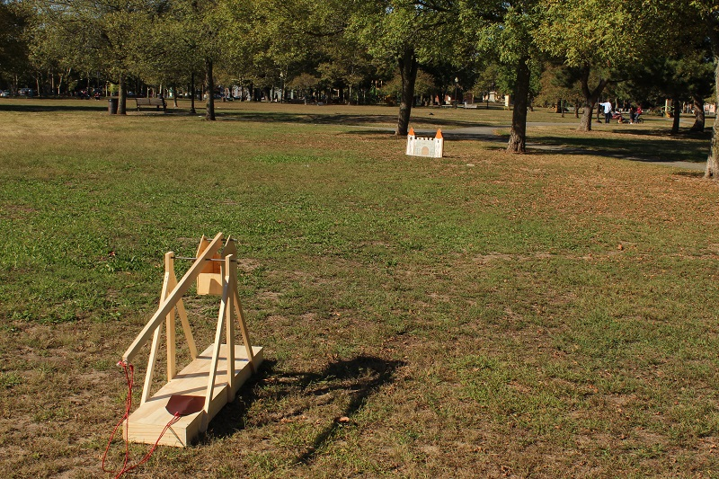

## More power
One of the best things you can do to make your trebuchet even more powerful is to add a bearing around the steel rod at the fulcrum of the swing arm. This will take a lot of the friction out of the motion. 

How heavy your ballast is depends on your trebuchet. Start with 10 lb (4.5 kg) of weight and give it a try, then add more weight. It will get to a point where adding more weight will not throw your projectile further. Want to control the distance it shoots? You can do this by controlling the weight in the ballast box. An easy thing to do is pre-make bags of sand and label them. Then you can just add or remove bags of sand to the ballast box, keeping track of the weight inside and the distance it throws

--- collapse ---
---
title: Fine-tuning
---
Want to improve the look of your trebuchet? There are a few things you can do, including tapering down the swing arm so it's thinner at the string/pouch end. This will also increase the efficiency. We tapered the swing arm down to a width of 1½˝ (38 mm) at the end. You can also paint or stain your trebuchet any colour or theme you desire.
--- /collapse ---

